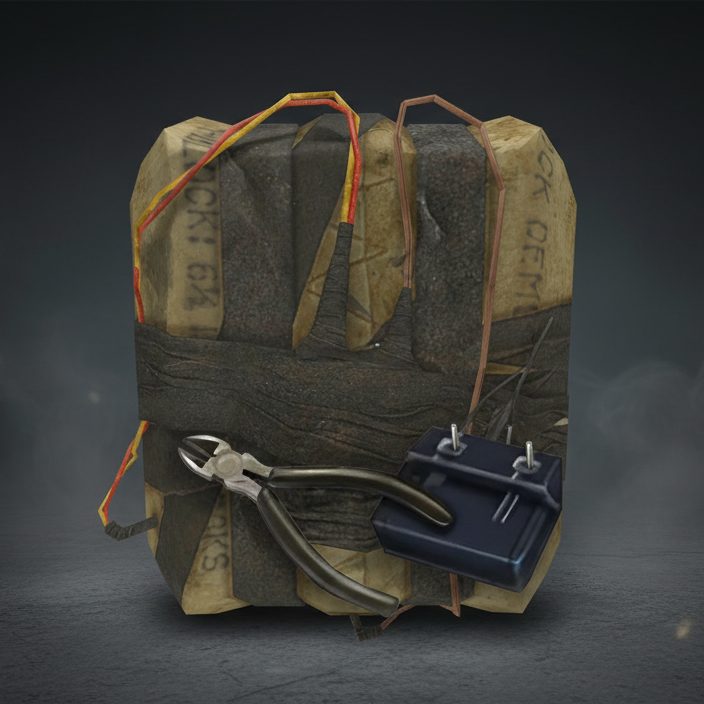



  
  <h1 style="margin: 0;">C4: Defuse System — Система обезвреживания</h1>

 
Улучшенная версия аддона C4 с добавленной мини-игрой обезвреживания бомбы.

## Особенности

- 🎮 Интерактивная мини-игра с перерезанием проводов
- 🔊 5 вариантов предупреждений при наведении на неправильный провод
- 💬 2 варианта подсказки при открытии
- 💥 5 вариантов озвучки неудачи
- ✅ Озвучка успешного обезвреживания

## Демонстрация

### Успешное обезвреживание

https://github.com/user-attachments/assets/1c278ab3-14b2-452c-8ab1-3a773f1aa3b2

### Неудачное обезвреживание

https://github.com/user-attachments/assets/5999da80-467a-402d-88ca-e8a6f667ec3a

https://github.com/user-attachments/assets/e26eefb2-81d5-4f23-99fd-2043e03fd31e

## Ссылки

 **Ссылка на Workshop:** https://steamcommunity.com/sharedfiles/filedetails/?id=3625020268

 **Оригинальный аддон:** [https://steamcommunity.com/sharedfiles/filedetails/?id=297646940](https://steamcommunity.com/sharedfiles/filedetails/?id=297646940)

 **Озвучивал:** [KYD_EDITS](https://music.yandex.ru/artist/11045621)

 **Контакт:** [t.me/devii_morris](https://t.me/devii_morris)

## Лицензия

**Голосовые файлы запрещено использовать на серверах без разрешения!**

Голосовые файлы защищены авторским правом [KYD_EDITS](https://music.yandex.ru/artist/11045621). Для использования на серверах требуется письменное разрешение. Подробности в файле [LICENSE](LICENSE).

